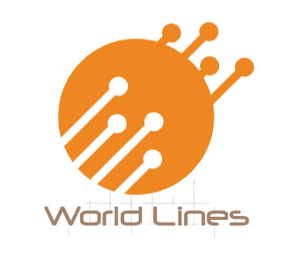

  
<a href="#abstract">Abstract</a> • <a href="#theory">Theory</a>  

---
## Abstract
This mini-project revolves around [Steins;Gate](https://en.wikipedia.org/wiki/Steins;Gate_(TV_series)), a sci-fi anime series that employs the hypothetical [black-hole theory](https://steins-gate.fandom.com/wiki/Time-travel_theories#Black_hole_theory) for time travel, with a setup built around the existence of different world lines.

## Theory
To elucidate more precisely, time here is comprised of infinite parallel lines called '**World Lines**', which are mutable in nature. These lines can branch off (just like in Git/hierarchial stuff) at divergence points created by an event significant enough to create a seperation.  
For instance, assume that a person died in the current timeline and in response to that you travel back in time to prevent his/her death. This action would create a divergence in the past from the time point of the person's death, resulting in two divergent world lines - one with the person's existence, and one without. The idea prevails for similar actions, wherein such changes induce the creation of multiple world lines. 

Note that such events that trigger the splitting of world lines can be of lesser magnitude in effect than the aforementioned case (based on the existence of a person, which is a strong example), such as simply from a point where someone didn't buy a winning-lottery ticket to one where he/she did. (which is the example used to illustrate the Butterfly effect)

Similar to the inclusion of divergence, there is this concept of convergence as well, which pertains to converging world lines. To elaborate on this, the term '**Attractor Field**' needs to be known as a pre-requisite, so quoting from the fandom's [wiki page](https://steins-gate.fandom.com/wiki/Attractor_Field):  
*An Attractor Field is a cluster of world lines that lead to a single converging point. While each strand may be slightly different, they're ultimately part of the same great structure and yield the same end result.*

The example used to convey this idea in the anime was the concept of a rope, held by its fibres. At a simple glance, a rope is unidirectional and comprised of interlocking threads, which can be thought of to represent the world lines. These threads although being twisted and different from each, altogether lock on to a converging point at the end of the rope, (plus move towards the same direction) which is the attractor field. Likewise, world lines are expected to have distinct individual changes, but for the ones in an attractor field, they all converge towards a specific event at a timestamp, something that will unequivocally occur.

Here is a mindmap I designed in XMind to illustrate this very concept with respect to an attractor field:

  

The green lines are meant to illustrate the world lines (which are meant to be parallel, as shown inside the slate-coloured rectangles). They diverge/split at a few points by some events (am using dot-based notation to indicate the same, as used in networks), but since they all fall within the same attractor field, there is a common end result (which I termed to be the 'certain outcome') taking place irrespective of the varying changes in each segregated world line. Simply put, these world lines all converge to an event that is certain to happen, which is what the phenomenon of [world line convergence](https://steins-gate.fandom.com/wiki/World_Line_Convergence) implies.