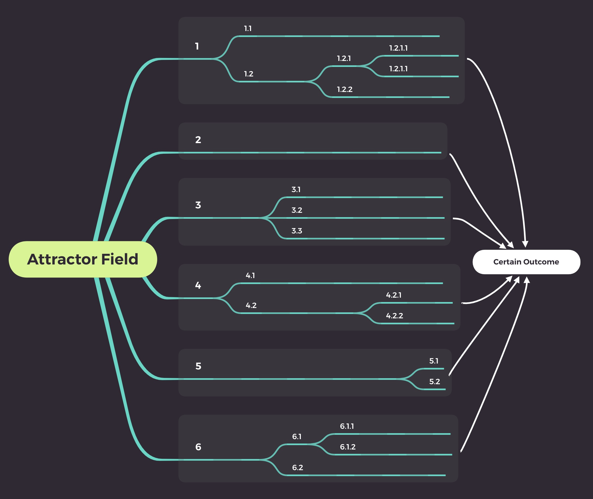

<p align = "center">
 <br>
<a href="#abstract">Abstract</a> • <a href="#theory">Theory</a> • <a href="#what-does-the-code-do">Code</a> • <a href="#extras">Extras</a> 
</p>

---
## Abstract
This mini-project revolves around [Steins;Gate](https://en.wikipedia.org/wiki/Steins;Gate_(TV_series)), a sci-fi anime series that employs the hypothetical [black-hole theory](https://steins-gate.fandom.com/wiki/Time-travel_theories#Black_hole_theory) for time travel, with a setup built around the existence of different world lines.

## Theory
To elucidate more precisely, time here is comprised of infinite parallel lines called '**World Lines**', which are mutable in nature. These lines can branch off (just like in Git/hierarchial stuff) at divergence points created by an event significant enough to create a seperation. <br>
For instance, assume that a person died in the current timeline and in response to that you travel back in time to prevent his/her death. This action would create a divergence in the past from the time point of the person's death, resulting in two divergent world lines - one with the person's existence, and one without. The idea prevails for similar actions, wherein such changes induce the creation of multiple world lines. 

Note that such events that trigger the splitting of world lines can be of lesser magnitude in effect than the aforementioned case (based on the existence of a person, which is a strong example), such as simply from a point where someone didn't buy a winning lottery ticket to one where he/she did. (which is the example used to illustrate the Butterfly effect)

Similar to the inclusion of divergence, there is this concept of convergence as well, which pertains to converging world lines. To elaborate on this, the term '**Attractor Field**' needs to be known as a pre-requisite, so quoting from the fandom's [wiki page](https://steins-gate.fandom.com/wiki/Attractor_Field): <br>
*An Attractor Field is a cluster of world lines that lead to a single converging point. While each strand may be slightly different, they're ultimately part of the same great structure and yield the same end result.*

The example used to convey this idea in the anime was the concept of a rope, held by its fibres. At a simple glance, a rope is unidirectional and comprised of interlocking threads, which can be thought of to represent the world lines. These threads although being twisted and different from each, altogether lock on to a converging point at the end of the rope, (plus move towards the same direction) which is the attractor field. Likewise, world lines are expected to have distinct individual changes, but for the ones in an attractor field, they all converge towards a specific event at a timestamp, something that will unequivocally occur.

Here is a mindmap I designed in XMind to illustrate this very concept with respect to an attractor field:

<p align = "center">
  
</p>

Depicted in a shade of turqouise green are the world lines (which are meant to be parallel, as shown inside the slate-coloured rectangles). They diverge/split at a few points by some events (am using dot-based notation to indicate the same, as used in networks), but since they all fall within the same attractor field, there is a common end result (which I termed to be the 'certain outcome') taking place irrespective of the varying changes in each segregated world line. Simply put, these world lines all converge to an event that is certain to happen, which is what the phenomenon of [world line convergence](https://steins-gate.fandom.com/wiki/World_Line_Convergence) implies, with reference to an attractor field.

World lines held by two of such fields are portrayed in Steins;Gate & Steins;Gate 0, one named '**Alpha**'(**α**) and one named '**Beta**'(**β**). As I mentioned earlier, there are specific events that are bound to happen for the world lines that are held within these attractor fields. These events include: 

- The death of Mayuri Shiina in Alpha.
- The death of Kurisu Makise in Beta.

Note that there are other effects in these world lines too (such as the creation of a dystopian world governed by SERN in alpha and the occurence of World War III in beta), but for this project I'm restricting myself to use only these for the purpose of determining the existence of these characters.

Although the aforementioned deaths are inevitable in **α** and **β** respectively, they can both be avoided in the **Steins;Gate** world line, which lies in between those attractor fields. Since it is loosely influenced by both the fields, it does not reach the final convergent result found in either field. In other words, both Mayuri and Kurisu are saved, (along with no negative impacts pressed onto the world, due to Kurisu's thesis being ruinated, leaving no scope for time travel) which is portrayed as the ideal ending for the anime. 

For the protagonist (Okabe Rintarou) to eventually reach this world line, he creates what he nomenclated to be the '[Divergence Meter](https://steins-gate.fandom.com/wiki/Divergence_Meter)'. This device is used to calculate the divergence number, which is a floating point representing the divergence value of the current world line in relation to the absolute world line of 0% divergence. For Alpha and Beta attractor fields, the values range between 0 to 0.99 and 1 to 1.99 respectively. For Steins;Gate, its the special number **1.048596**, just (barely) crossing the 1% barrier.

## What does the code do?
For the moment, its a pretty simple program which just serves as a rng-based divergence calculator with respect to Steins;Gate.

Taking the number of world lines as user input, the code generates random divergence numbers of that count to associate them with the Alpha and Beta fields each. The average of these figures are taken and the divergence from the Steins;Gate line is calculated. Additional attractor fields (such as **γ** & **δ**) can be accommodated, but to include them here felt unnecessary due to the lack of association with the anime series.

## Extras
A few thoughts/notes: (spoilers included!)
- Names from the anime that tend to represent real-world entities are changed by a letter to avoid copyright issues. For instance, 'IBM 5100' was made 'IBN 5100' and 'CERN' was made 'SERN'.
- Although Steins;Gate 0 is comparatively disconsolate to many, the ending shines some light for Okabe saving Suzuha & Mayuri. I believe this was required in one way, since the later episodes from the OG series + the movie mostly focused on Kurisu. 
- The visual novel (VN) is worth reading, provided you have time for it. 
- Follow this watch order for a serial progress of events:
```go
Timeline 
├──> Steins;Gate episodes 1-22
│    ├──> episode 23-β  │
│    └──> Steins;Gate 0 │
│                       ├──> episode 23
│                       └──> episode 24 & 25 
└──> Load Region of Déjà Vu (The movie)
```
Go downwards one step at a time, and watch the mentioned episode(s) towards the end of each line.

The anime has a bit of complexity, so as a side-effect of scrolling this far, this readme might help the readers strengthen his/her understanding about the aforementioned concepts in Steins;Gate, or in turn confuse them all the more :)

## License

The idea behind this repository and the content in it (inclusive of illustrations) is licensed as per the terms and conditions laid out in this [file](Miscellaneous/License.md). The representation of Steins;Gate in this project refers to the TV-series/Anime version, held under its own license.